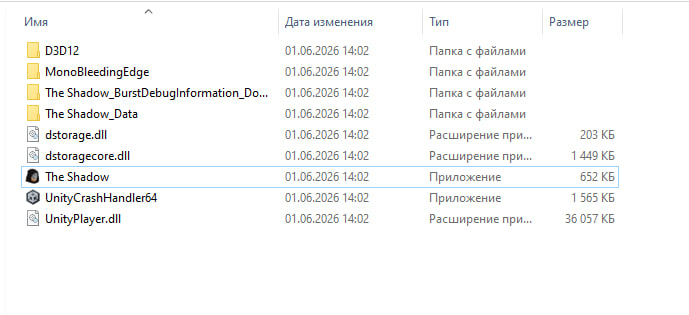
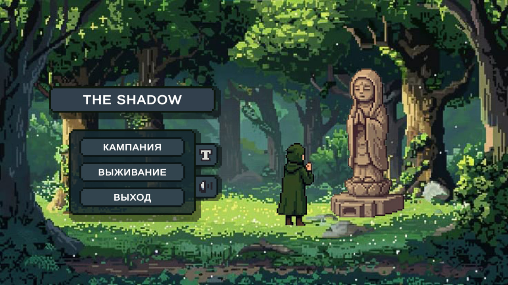
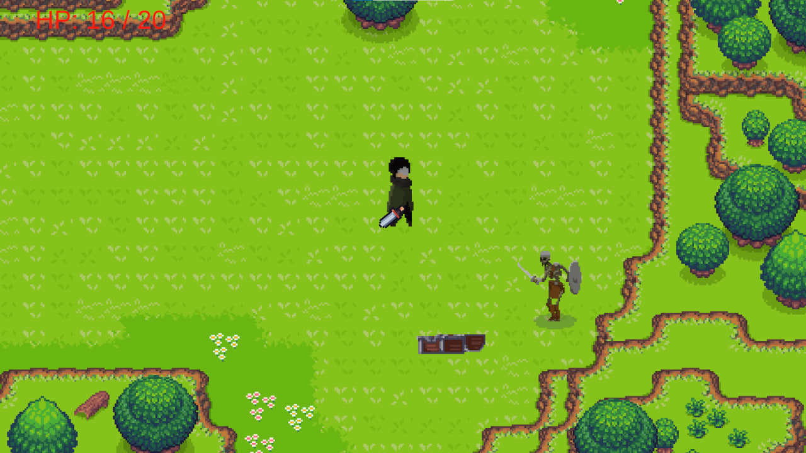
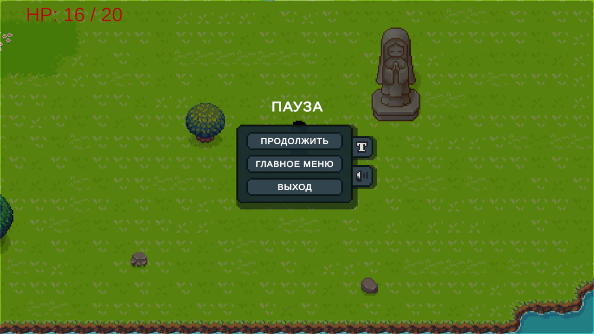
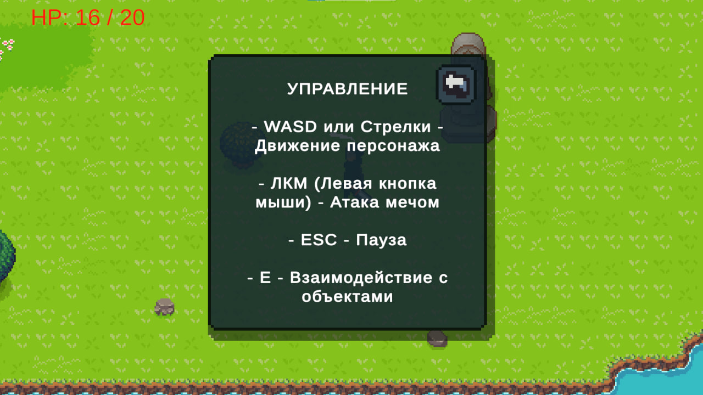
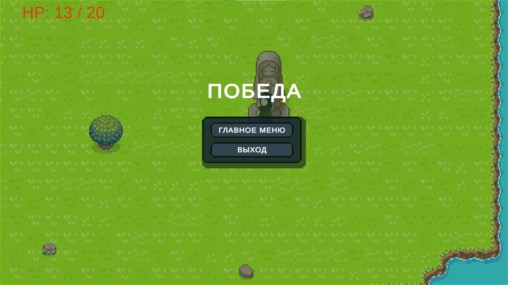
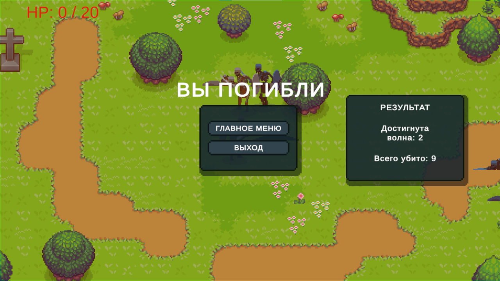

# Трейлер игры: 
[Ссылка на трейлер](https://rutube.ru/video/private/8f58026b413a53c666cf851f5f97be05/?p=Jm9NmBpgOgH_sQE9UP-pzA)

# Как играть

Для того, чтобы сыграть в игру, вам необходимо скачать архив с файлами игры по [ссылке](ссылка_на_релиз), распаковать его в удобное место, и запустить файл **The Shadow.exe**:

# Управление

1. Для взаимодействия с интерфейсом главного меню используется мышка.
2. Управление персонажем осуществляется при помощи клавиш **WASD** или **стрелок**.
3. Атака мечом выполняется **левой кнопкой мыши (ЛКМ)**.
4. Взаимодействие с объектами (сундуки, гроб, статуя) - клавиша **E**.
5. Клавиша **ESC** используется для того, чтобы поставить игру на паузу.

## Режимы игры

### 🗺️ Режим Кампании (Campaign)
Ваша задача - исследовать мир, собирать сундуки с предметами, уничтожать всех врагов на локации и дойти до финала. Переходите на следующий уровень через гроб, а завершите игру, взаимодействуя с финальной статуей.

### ⚔️ Режим Выживания (Survival)
Ваша задача - выжить как можно дольше против бесконечных волн врагов и набрать максимальное количество очков. С каждой волной враги становятся сильнее и многочисленнее. Попытайтесь побить свой рекорд!

# Скриншоты игры

